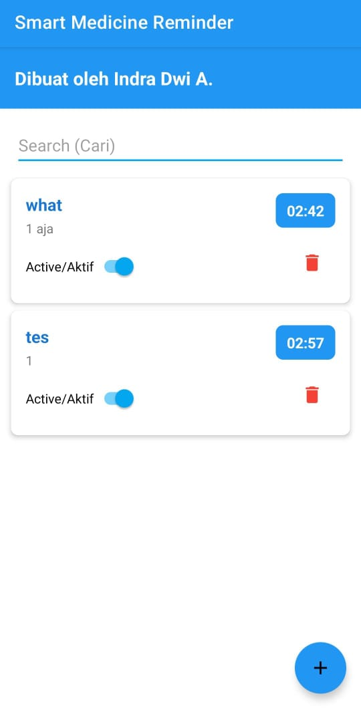
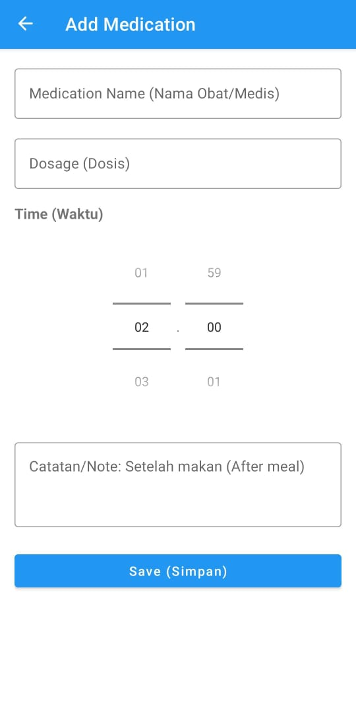

# Smart Medicine Reminder

 

## Overview

Smart Medicine Reminder adalah aplikasi Android yang membantu pengguna mengelola pengingat minum obat dengan fitur CRUD (Create, Read, Update, Delete). Aplikasi ini dirancang untuk memastikan pengguna tidak melewatkan jadwal minum obat mereka dengan menyediakan notifikasi yang tepat waktu.

## Fitur Utama

- ✅ **Tambah Pengingat** - Buat pengingat obat baru dengan waktu dan dosis yang spesifik
- 🔔 **Notifikasi Tepat Waktu** - Dapatkan pengingat ketika waktu minum obat tiba
- 📋 **Lihat Pengingat** - Akses daftar lengkap pengingat obat yang aktif
- ✏️ **Edit Pengingat** - Perbarui informasi pengingat yang sudah ada
- 🗑️ **Hapus Pengingat** - Buang pengingat yang tidak diperlukan
- 📱 **Getar** - Perangkat bergetar saat notifikasi muncul

## Teknologi yang Digunakan

- **Java** - Bahasa pemrograman utama
- **Android Room Database** - Penyimpanan dan pengelolaan data
- **AlarmManager** - Pengaturan alarm dan notifikasi
- **BroadcastReceiver** - Penanganan alarm dan tampilan notifikasi
- **Material Design** - UI yang modern dan user-friendly

## Screenshot

| Home Screen                             | Add Reminder Screen                     |
|-----------------------------------------|-----------------------------------------|
|  |  |

## Persyaratan

- Android 8.0 (Oreo) atau lebih tinggi (API Level 26+)

## Instalasi & Penggunaan

1. Clone repository ini:
   ```sh
   git clone https://github.com/Xnuvers007/smart_medicine_reminder.git
   ```

2. Buka proyek di Android Studio

3. Build dan jalankan aplikasi di emulator atau perangkat fisik

4. Mulai tambahkan pengingat obat Anda

## Struktur Proyek

```
app/src/main/java/dev/indra/smartmedicinereminder/
│-- AddEditMedicationActivity.java   # Menambah/mengedit pengingat
│-- AlarmHelper.java                 # Utilitas untuk mengatur alarm
│-- BootReceiver.java                # Menangani restart perangkat
│-- DatabaseHelper.java              # Manajemen database SQLite
│-- MainActivity.java                # Aktivitas utama aplikasi
│-- Medication.java                  # Model data obat
│-- MedicationAdapter.java           # Adapter untuk tampilan daftar
│-- ReminderReceiver.java            # Menangani notifikasi pengingat
│-- NotificationDismissReceiver.java # Menangani notifikasi ditutup
```

## Izin yang Digunakan

Aplikasi ini memerlukan beberapa izin untuk berfungsi dengan baik:

- `POST_NOTIFICATIONS` - Mengirim notifikasi ke pengguna
- `RECEIVE_BOOT_COMPLETED` - Memastikan alarm tetap aktif setelah reboot
- `WAKE_LOCK` - Memastikan alarm dapat membangunkan perangkat
- `SCHEDULE_EXACT_ALARM` - Menjadwalkan alarm dengan presisi tinggi
- `VIBRATE` - Menggetarkan perangkat saat notifikasi muncul

## Kontribusi

Kontribusi Anda sangat dihargai! Berikut langkah-langkah untuk berkontribusi:

1. Fork repository ini
2. Buat branch baru (`git checkout -b feature/fitur-baru`)
3. Commit perubahan Anda (`git commit -m 'Menambahkan fitur baru'`)
4. Push ke branch (`git push origin feature/fitur-baru`)
5. Buat Pull Request

## Lisensi

Proyek ini dilisensikan di bawah [Lisensi MIT](LICENSE).